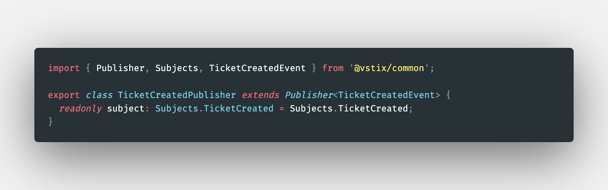
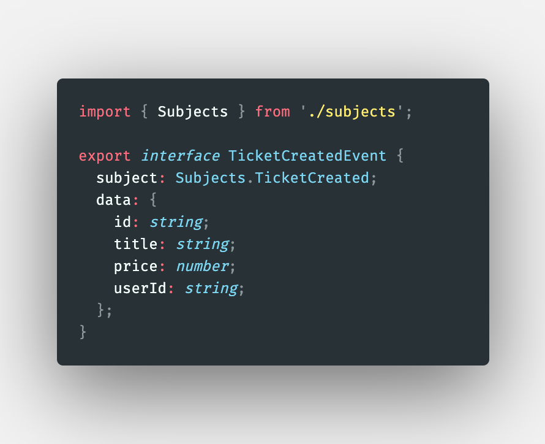
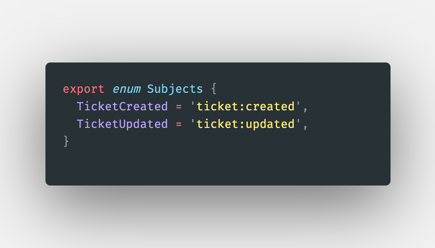

# Ticketing Application

> The rush of excitement we coders feel when we make a computer do something new using nothing more than solitude, brain power, and typing. - Ken Kocienda in Creative Selection

This is a microservices based application written in `TypeScript`. Frontend is a server side rendered react application written in `Next.js` and styled with `tailwind-css`. Backend services are written in `express.js`and`node`. We use `MongoDB`and`Redis`for our data storage needs. All interservice communication is aynchronous. We deploy this application by first containerizing individual services using`Docker`. We then orchestrate the containers in a `Kubernetes cluster` to make our product reliable and more manageble. We follow [12 factor app](https://12factor.net/) guidlines while building this application.

To run the app, make sure you have `Docker for Desktop` and `skaffold`. Once installed, run below

> skaffold dev

## Product Requirements / Business Logic

1. **Users** can list a **ticket** for an event for sale
2. Other users can purchase this **ticket**
3. Any user can _list_ tickets for sale and _purchase_ tickets
4. When a user _attempts_ to purchase a ticket, the ticket is `locked` for 15 minutes. The users have 15 mins to enter their payment info
5. While locked, no other user can purchase the ticket. After 15 mins, ticket should `unlock`
6. Ticket prices can be edited if they are not locked

## Technical Solution Design

### Resource Types

Let's think about the entities in our domain that we are trying to model. It is useful to think about the domain we are trying to model. People sometime

1. **User**
   - user.id
   - user.name
   - user.password
   - user.email
   - user.phone
2. **Ticket**
   - ticket.id - pk
   - ticket.name - string
   - ticket.description - string
   - ticket.userId - Ref to User
   - ticket.orderId - Ref to Order
3. **Order** - represents the intent of the user to buy the ticket, we lock the ticket at this stage
   - order.id
   - order.userId - Ref to User
   - order.ticketId - Ref to ticket
   - order.status - Created | Cancelled | Awaiting Payment | Completed
   - order.expiresAt - Date
4. **Charge**
   - charge.id
   - charge.orderId - Ref to Order
   - charge.status - Created | Failed | Completed
   - charge.amount - numeber
   - charge.stripeId - string
   - charge.stripeRefundId - string

### Service Types

1. **auth** : Everything related to user signup/signin/signout
2. **tickets**: Ticket creating/editing. Knows about wheather a ticket can be updated
3. **orders**: Order creation/editing
4. **expiration**: watches for orders to be created, cancels them after 15 minutes
5. **payments**: Handle credit card payments. Cancel order if payment fails, completes if payment succeeds

> We are creating individual service to manage each type of resource. This probably is not neccessary. Choices will depend on your use cases, number of resources, business logic tied to each resource etc. You can look into 'feature-based design` which might be better. read more about it [here](https://web.mst.edu/~liou/ME459/cad_cam_intgr/feature_based_dgn.html)

### Events

1. User
   - UserCreated
   - UserUpdated
2. Ticket
   - TicketCreated
   - TicketUpdated
3. Order
   - OrderCreated
   - OrderCancelled
   - OrderExpired
4. Charge
   - ChargeCreated

## Notes

- We use ingress-nginx for communicating with kubernetes cluster from outside
  - install it if you reset your cluster from [here](https://kubernetes.github.io/ingress-nginx/deploy/)

### Normalisation Strategies

1. How do we validate all POST requests are well formed with relavent fields ?
   - We use [express-validator](https://express-validator.github.io/docs/) to validate body.
   - Handling validation errors
2. There are many other sources of errors which will result in an error, such as user already exists error, db down error etc.
   - We absolutely have no idea what might go wrong and where
   - We have to make sure that we catch all such errors and handle them in a `consistent manner`.
   - All error responses should be `structurally consistent` for `a service` or even `accross services` which maybe written in different technology stack.

> We solve this by wrting an error handling middlewareto process errors, give them consistent structure, and send back to the user. We also capture all possible errors leveraging express's error handling mechanism (call the next function). You can read more about express error handling [here](https://expressjs.com/en/guide/error-handling.html)

1. Error handling classes which are sub classes of `CustomError`.
2. `CustomError` is an **abstract class** with `statusCode` _variable_ and `serializeErrors` _function_.
3. We use `express-async-errors` to also handle async errors in express similar to sync errors. Otherwise, express requires us to call next funtion in the middleware to handle error properly.

### Authentication for microservices

#### Cookies vs JWT: refresher

1. Cookies
   - Are a transport mechanism
   - Moves any kind of data between browser and server
   - Automatically managed by the browser
2. JWT's
   - Authentication / Authoriztion mechanism
   - Stores any data we want
   - We have to manage it manually

We use asynchronous auth, i.e each service knows how to authenticate a user (using JWT). This allows us to remove sync dependency between services and makes our architecture decoupled. JWT's timing functionality can be used to implement scenarios such as banning / blocking a user on the platform.

1. We use `cookie-session` for setting and reading the cookies. We set `secure: true` for only seeting in https connections. We also set `signed: false` to not sign the cookie, because in our case cookie itself is JWT.
2. We use `jsonwebtokens` to `sign` and `verify` JWT in this application.

#### Requirements for authentication mechanism in microservices architecture

1. Must be able to tell details about the user
2. Must be able to handle authorization info
3. Must have a built-in, tamper ressistant way to expire or invalidate itself
4. Must be easily understood between different languages
   - Cookie handling accross languages is usually an issue when we encrypt the data in the cookie
   - Hence, we do not encrypt the data in the cookie, because
   - JWT are tamper ressistant
   - One can encrypt the cookie if it's a hard requirement
5. Must not require a backing data store on the server

> JWT's meet all the above requirement. Our frontend is a SSR (server side rendered) react app hence, we use cookies as a transport mechanism for our JWT's.

#### Secret sharing in kubernetes cluster

For creating typical objects in the kubernetes cluster we have used declarative approach by writing config files in YAML. We created below secret imperitively because we were in a dev environment, (in particular we stored jwt-key)

```bash
kubectl create secret generic jwt-secret --from-literal=JWT_KEY=yourkey
```

#### Common Response Properties

We have used `toJSON` function in `userSchema` to define the structure of response that we send back to the user, more importantly, we delete the `__v` and `password` fields and remap `_id` to `id`.

> more reasearch into kubernetes namespaces needed

Url to make request for SSR rendering to get authed data

```bash
> kubectl get namespaces
> kubectl get services -n ingress-nginx
```

> const url = 'http://ingress-nginx-controller.ingress-nginx.svc.cluster.local';

Difficult to remember, we can setup a `external name service`. This is not neccessary. We do this to avoid remembering the above monstrosity.

### Common npm package to share resuable functionality between services

- common is a npm package called `@vstix/common` which other services use
- compile to normal js and a type definition file

  We can install `@vstix/common` by:

  > npm install @vstix/common

Or, we can update it by (this is more often than not as we add functionality to the common lib which then can be used by other services)

> npm update @vstix/common

### Event Bus: NATS Streaming Server

- clientID concept
- channels / topics concept
- manual acknowledgement option
- queue group concepts
- Concurrency Handling
  - Event Redivelry
  - Durable Subscriptions

#### Implementation design decisions

Every service in the application has some similar requirements to publish / subscribe to different channels (topics if you come from kafka land) of interest. We have used some object oriented concepts to reduce the boilerplate code to achieve this functionality and make it really easy to send / recieve events. We have base abstract classes (`Publisher<T extends Event>` and `Listener<T extends Event>`) in the `@vstix/common` centralised library which each service can extend to either publish events on specific channels or listen for and recieve updates from the system. We also provide centralised source of different events in our system and export it as an enum called `Subjects`, so that we remove the case of typing errors on the individual service developers.

For example, to create publisher for ticket:created event, `TicketCreatedPublisher` , we can define a published as follows



Where TicketCreatedEvent is defined in `@vstix/common` as follows



and `Subjects` is an enum exported from `@vstix/common` as follows



### Order Service

1. Scaffolding orders _(or any new service)_ service
   - Duplicate tickets service
   - make name changes and install dependencies
   - build an image out of the service
   - Create a Kubernetes deployment file
   - setup file sync options in skaffold.yaml file
   - setup routing rules in the ingress service

## TODOS

- Handle ticket getting created/updated and not being able to publish event scenario.

  - [Transactions in Mongoose](https://mongoosejs.com/docs/transactions.html)

  - [Solution approaches to dual write problem in distributed applications](https://developers.redhat.com/articles/2021/09/21/distributed-transaction-patterns-microservices-compared#the_modular_monolith)

- Add/learn obervability to microservices using [this](https://github.com/joao-fontenele/express-prometheus-middleware#readme)

  - [prometheus docs](https://prometheus.io/docs/concepts/data_model/)
  - [Maybe play with this ? loglevel for logging in our application](https://www.npmjs.com/package/loglevel)

- It can get confusing and hard to manage all the http status codes we are sending to our api users (in this case our frontend application). We can use [http-status-codes](https://www.npmjs.com/package/http-status-codes) npm module handle this.

## References

- [How I (Kent C Dods) structure express applicstions](https://kentcdodds.com/blog/how-i-structure-express-apps)
- [Kubernetes Failure Stories](https://k8s.af/)
- [Design Patterns](https://en.wikipedia.org/wiki/Design_Patterns)
- [Database Per Service Design](https://microservices.io/patterns/data/database-per-service.html)
- [Incement Issue on Containers](https://increment.com/containers/)
- [To be aimless by deliberate practice](https://www.youtube.com/watch?v=Q4-FHlWNJa4)
- [How Big Tech Runs Tech Projects and the Curious Absence of Scrum](https://newsletter.pragmaticengineer.com/p/project-management-in-tech)]
